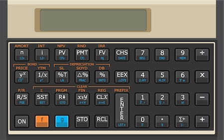

# Calculadora financeira HP-12C (Emulador)

**HP-12C** é uma calculadora financeira programável utilizada na execução de cálculos financeiros envolvendo juros compostos, taxas de retorno, amortização. A **HP-12C** utiliza método _RPN_ e introduziu o conceito de fluxo de caixa nas calculadoras, utilizando sinais distintos para entrada e saída de recursos.

## Clique [**aqui**](https://jonasjf360.github.io/calculadora-hp12c/ "Clique e acesse agora!") para acessa-la agora mesmo.

### Clique [**aqui**](https://pt.wikipedia.org/wiki/HP_12C "HP-12C Wikipédia") para saber mais sobre a HP-12C ou para saber como utiliza-la corretamente.

**Obs.:** _Não sou o criador desse desta calculadora, apenas modifiquei sua aparência e atualizei alguns parâmetros para torna-la mais usável._
